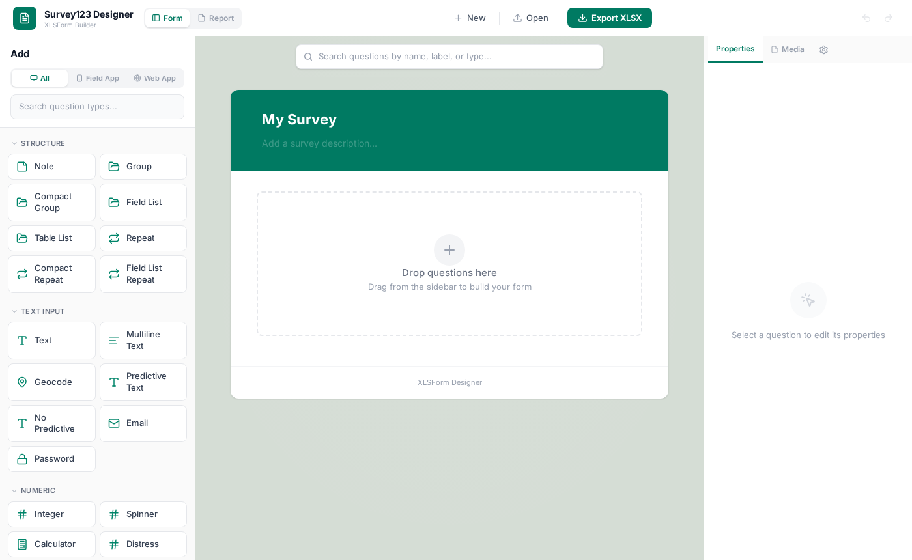
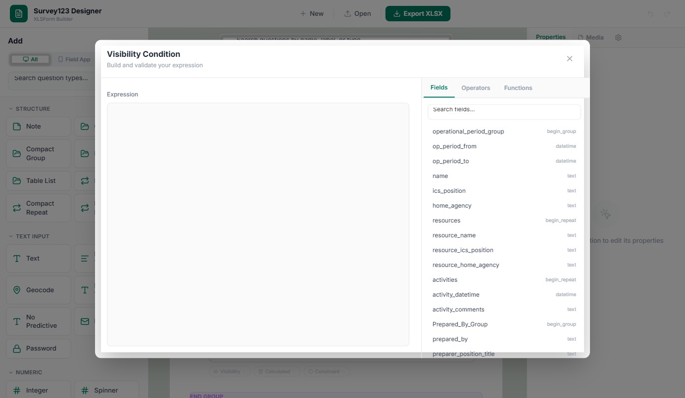
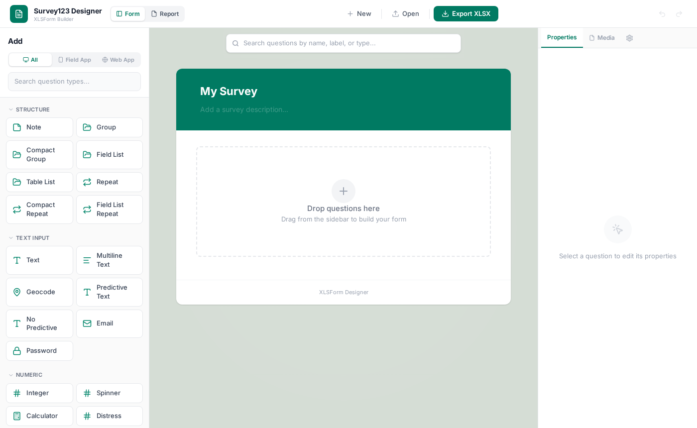

# Survey123 Designer

> **Work in Progress** — This is a personal project I built for my own use, but I'm sharing it publicly in case others find it helpful. It's under active development and may have rough edges. Feedback, bug reports, and contributions are very welcome!

A standalone, web-based WYSIWYG form designer for building ArcGIS Survey123 XLSForm surveys — plus a report template builder for generating `.docx` feature reports. Drag-and-drop question types onto a live canvas, configure properties visually, and export a ready-to-publish `.xlsx` file — no XLSForm syntax knowledge required.

**[Try it live](https://palavido-dev.github.io/survey123-designer/)** — runs entirely in the browser, no install needed.

[](https://paypal.me/palavido)
[](https://github.com/sponsors/palavido-dev)

---


*Three-column layout: question palette (left), form canvas (center), properties panel (right)*


*Visual expression builder with field picker, operators, and function library*


*Report Template Builder with field palette, rich text editor, and syntax reference*

## Why This Exists

ArcGIS Survey123 is powerful, but authoring surveys still means wrestling with XLSForm spreadsheets or using Esri's hosted designer (which requires an ArcGIS Online/Enterprise account). This project provides a free, offline-capable alternative that runs entirely in the browser.

It solves a few key pain points: visual drag-and-drop instead of typing into Excel rows, a guided expression builder instead of hand-writing XPath, platform-aware question filtering (Field App vs. Web App), and instant preview of how questions will look as you build.

## Features at a Glance

### Drag-and-Drop Form Builder

41 question types across 9 categories — text, numeric, selection, location, date/time, media, structure, hidden/calculated, and metadata. Appearance variants show up as separate draggable cards (Multiline Text, Spinner, Signature, Likert Scale, etc.), so you always know what you're getting. Reorder questions by dragging within the canvas, and nest them inside groups and repeats.

### Visual Expression Builder

Build `relevant`, `constraint`, and `calculation` expressions without memorizing XPath syntax. The expression builder provides a field picker (browse all form fields with type badges, click to insert `${field}` references), an operator palette (comparison, logical, arithmetic, and common values), and a categorized function library covering selection, text, math, date, and logic functions — each with a description of what it does.

### Report Template Builder

A full report template builder for creating Survey123 Feature Report `.docx` templates. Switch to Report mode via the toolbar toggle to access:

- A field palette listing all form fields organized by type (text, date/time, select, etc.) — click to insert `${fieldname}` tokens into the editor
- A rich text editor (TipTap) with formatting toolbar (bold, italic, underline, headings, lists, tables, code blocks)
- A syntax reference panel showing all Survey123 report token patterns: field values, filters, conditionals, repeat blocks, images, dates, and multiline fields
- Import existing `.docx` templates and export your work back to `.docx`

### Platform Filter

Toggle between **All**, **Field App**, and **Web App** in the sidebar to filter the question palette. Web App mode hides field-only types (barcode, geotrace, audio recording, file upload, etc.) so you only see what your target platform actually supports.

### Full Property Editor

Every XLSForm column is supported through collapsible sections in the right-side properties panel: Basic (name, label, hint, guidance hint, choice list), Validation (required, constraint), Logic (relevant, calculation, default, choice filter, read-only), Appearance, Parameters, Media, Body (Esri extensions like input masks and styles), and Bind (Esri field type, length, alias, and workflow settings).

### Inline Editing

Double-click any question label on the canvas to edit it directly. For Note-type questions, double-clicking opens a rich text editor (TipTap) with bold, italic, underline, links, headings, and bullet list support. Field names can also be edited inline from the properties panel with real-time validation for illegal characters, duplicates, and reserved words.

### CSV File Support

For `select_one_from_file` and `select_multiple_from_file` questions, upload CSV files directly in the designer. A built-in CSV editor lets you modify data inline — edit cells, add or remove rows and columns, rename headers, search across all columns, and sort by clicking column headers. CSV badge indicators on question cards give quick access to the editor.

### Media Panel

A dedicated Media tab in the properties panel shows all file and CSV references across your form at a glance, with upload status indicators (green checkmark for uploaded, amber warning for missing). Click any uploaded file to open it in the CSV editor.

### Question Search

A persistent search bar at the top of the form canvas lets you find questions by name, label, or type. Results show a match count with previous/next navigation, and the canvas auto-scrolls to each match. Ctrl+F focuses the search bar from anywhere.

### Choice List Editor

Create and manage choice lists for select_one, select_multiple, and rank questions. Add, remove, and reorder choices with inline editing. Choice lists are shared across questions via `list_name` references, just like in XLSForm.

### Auto-Save & Recovery

Your work is automatically saved to the browser's IndexedDB storage as you edit. If the page is accidentally refreshed or the browser crashes, a recovery banner appears on next load showing the form title, question count, and when it was last saved — with options to keep working or discard and start fresh. A subtle "Saved X ago" indicator in the bottom-right corner confirms auto-save status.

### XLSX Import & Export

Open any existing Survey123 `.xlsx` form to continue editing, or start from scratch. Export produces a spec-compliant `.xlsx` file with `survey`, `choices`, and `settings` sheets, including all Esri extension columns when populated.

#### Survey123 Connect-Style Excel Output

Exported `.xlsx` files include the same quality-of-life features found in Survey123 Connect-generated spreadsheets:

- **Data validation dropdowns** on the `type`, `appearance`, `required`, `readonly`, `bind::type`, `bind::esri:fieldType`, and `bind::esri:fieldLength` columns — with type-aware appearance lists (e.g., text questions only show text-valid appearances)
- **Row shading** for groups (purple `#E8DEF8`) and repeats (teal `#D0F0E8`) to visually distinguish structural nesting
- **Styled header row** with dark background and white bold text
- **Reference sheets** (`_appearances`, `_fieldtypes`) with named ranges powering the dropdowns

### Other

Undo/Redo with keyboard shortcuts (Ctrl+Z / Ctrl+Shift+Z), question type and field name indicators on each card, collapsible groups, and form-level settings (title, form ID, version, style, default language).

## Getting Started

### Prerequisites

Node.js 18+ and npm.

### Install & Run

```bash
git clone https://github.com/palavido-dev/survey123-designer.git
cd survey123-designer
npm install
npm run dev
```

Open [http://localhost:5173](http://localhost:5173) in your browser.

### Build for Production

```bash
npm run build
```

Output goes to `dist/`. Deploy to any static hosting (GitHub Pages, Netlify, Vercel, S3, etc.).

## Tech Stack

| Layer | Technology |
|-------|-----------|
| Framework | React 19 + TypeScript |
| Build | Vite 8 |
| Styling | Tailwind CSS v4 |
| State | Zustand (with persist middleware + IndexedDB via idb-keyval) |
| Drag & Drop | @dnd-kit (core + sortable) |
| Rich Text | TipTap |
| XLSX | xlsx-js-style (SheetJS fork with cell styling) + JSZip post-processing |
| Report | mammoth (docx import) + docx (docx export) |
| Icons | Lucide React |

## Project Structure

```
src/
  App.tsx                          # Root layout + error boundary + recovery banner
  main.tsx                         # Entry point
  types/
    survey.ts                      # Full XLSForm type definitions
    report.ts                      # Report template types
  data/questionTypes.ts            # Question catalog, appearances, row factory
  store/
    surveyStore.ts                 # Zustand store with undo/redo + IndexedDB persist
    reportStore.ts                 # Report template state
  utils/
    icons.tsx                      # Lucide icon resolver
    xlsxExport.ts                  # XLSX generation + import + JSZip post-processing
    validation.ts                  # Row & expression validation
    reportDocx.ts                  # Report template .docx import/export
  components/
    sidebar/QuestionPalette.tsx    # Draggable question cards + platform filter
    canvas/
      FormCanvas.tsx               # Drop zone, sortable list, sticky search
      SortableQuestionRow.tsx      # Question row with live preview + inline editing
    properties/
      PropertiesPanel.tsx          # Right panel shell (tabs: Properties | Media | Settings)
      QuestionProperties.tsx       # Dynamic property editor
      ExpressionBuilder.tsx        # Visual expression builder with wizard + functions
      ChoiceListEditor.tsx         # Choice list management
      CsvFilePicker.tsx            # CSV upload with delimiter auto-detection
      CsvEditorModal.tsx           # Spreadsheet-style CSV editor
      MediaPanel.tsx               # Media references overview + upload status
      FormSettingsEditor.tsx       # Form-level settings
      RichTextEditor.tsx           # TipTap rich text for note fields
      ParameterBuilder.tsx         # Key-value parameter editor
    report/
      ReportFieldPalette.tsx       # Report field list organized by type
      ReportCanvas.tsx             # TipTap editor for report templates
      ReportPropertiesPanel.tsx    # Template actions + syntax reference
    toolbar/Toolbar.tsx            # Top bar (New, Open, Export, Undo, Redo, Mode toggle)
```

## Supported Question Types

| Category | Types |
|----------|-------|
| Structure | Note, Group, Compact Group, Field List, Table List, Repeat, Compact Repeat, Field List Repeat |
| Text Input | Text, Multiline Text, Geocode, Predictive Text, No Predictive, Email, Password |
| Numeric | Integer, Spinner, Calculator, Decimal, Distress Scale, Range/Slider |
| Selection | Autocomplete, Compact Select, CSV Autocomplete, Dropdown, Likert Scale, Rank, Select Multiple, Select Multiple (CSV), Select One, Select One (CSV) |
| Location | Geopoint, Geotrace*, Geoshape* |
| Date & Time | Date, Year Only*, Month-Year*, Time, Date & Time |
| Media & Files | Photo, Signature, Draw*, Annotate*, Audio*, File Upload*, Barcode/QR* |
| Hidden & Calculated | Calculate, Hidden |
| Metadata | Start Time, End Time, Username, Device ID* |

*\* = Field App only (hidden in Web App mode)*

## Roadmap

See [ROADMAP.md](ROADMAP.md) for the full list of completed and planned features.

## Support This Project

If you find this project useful, consider supporting its development:

- [Donate via PayPal](https://paypal.me/palavido)
- [Sponsor on GitHub](https://github.com/sponsors/palavido-dev)

## License

MIT
